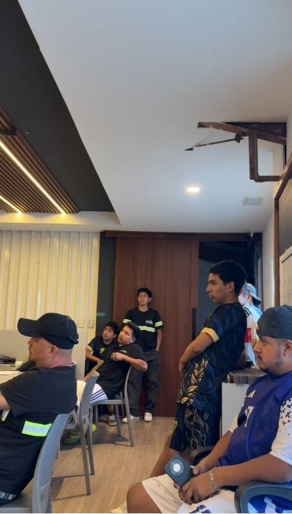
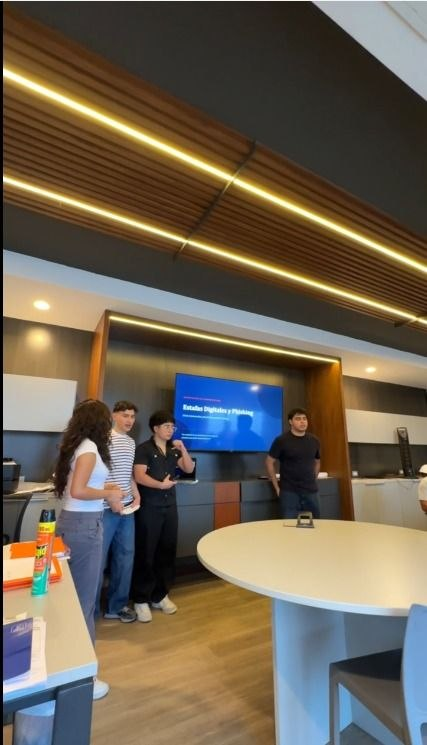
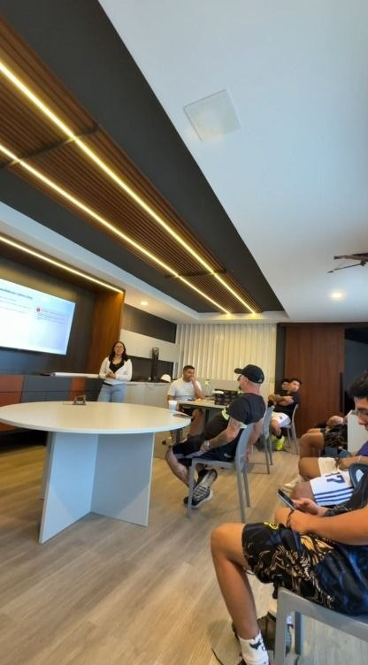

  

    

      Universidad de San Carlos de Guatemala
    

    

      Facultad de Ingeniería — Escuela de Ciencias y Sistemas
    

  

  

    

      Curso: Comunicación Asertiva
    

    

    <h1 style="font-size: 2.3rem; color: #1a365d; text-transform: uppercase; margin: 15px 0; letter-spacing: 1.5px; font-weight: 700;">
      INFORME FINAL: PROYECTO 1
    </h1>
    <h3 style="font-size: 1.2rem; color: #2b6cb0; font-weight: 400; margin-top: 10px; margin-bottom: 0;">
      Estafas Digitales y Phishing
    </h3>
    

  

  

    <table style="width: 100%; border-collapse: collapse; border: none;">
      <tr style="border: none;">
        <td style="padding: 6px 0; font-weight: bold; color: #1a365d; width: 140px; vertical-align: top;">
          Integrantes:
        </td>
        <td style="padding: 6px 0; color: #2d3748;">
          <ul style="margin: 0; padding-left: 20px; list-style-type: disc;">
            <li style="margin-bottom: 4px;">202501331 — Lucia Izabel Ortiz Paz</li>
            <li style="margin-bottom: 4px;">202500355 — Rodrigo José Gutiérrez López</li>
            <li style="margin-bottom: 4px;">202503543 — Christian Alejandro Juarez Perez</li>
            <li style="margin-bottom: 4px;">202502481 — Francisco Javier Chivichón Fernández</li>
            <li style="margin-bottom: 4px;">202507797 — Fabiola Jimena Sabán López</li>
            <li style="margin-bottom: 4px;">202502281 — Daniel Sebastián Hernandez Valle</li>
          </ul>
        </td>
      </tr>
      <tr style="border: none;">
        <td style="padding-top: 16px; padding-bottom: 6px; font-weight: bold; color: #1a365d; vertical-align: top;">
          Fecha de Entrega:
        </td>
        <td style="padding-top: 16px; padding-bottom: 6px; color: #2d3748;">
          23 de septiembre de 2026
        </td>
      </tr>
    </table>
  

---

# Índice

1. Resumen Ejecutivo
2. Objetivos del Proyecto
3. Desarrollo de la Capacitación
4. Autoevaluación mediante FODA
5. Conclusiones
6. Anexos

---

# 1. Resumen Ejecutivo

El presente documento corresponde al **Informe Final del Proyecto 1** del curso **Comunicación Asertiva para la Transferencia de Conocimiento Técnico**.

El proyecto consistió en el diseño, planificación y ejecución de una capacitación presencial titulada **"Estafas Digitales y Phishing"**, orientada a fortalecer el conocimiento del público sobre los principales riesgos de fraude digital y las medidas de prevención aplicables en la vida cotidiana.

Durante la actividad se emplearon estrategias de comunicación asertiva mediante un lenguaje claro, ejemplos cotidianos, casos reales y actividades participativas que facilitaron la comprensión del contenido técnico.

Asimismo, el proyecto permitió desarrollar habilidades de organización, liderazgo, adaptación y trabajo colaborativo entre los integrantes del equipo.

---

# 2. Objetivos del Proyecto

## 2.1 Objetivo General

Transmitir conocimientos prácticos sobre estafas digitales y phishing mediante una capacitación presencial estructurada, aplicando técnicas de comunicación asertiva que favorezcan la comprensión del público.

## 2.2 Objetivos Específicos

- Explicar qué son las estafas digitales y el phishing.
- Identificar las principales señales de un mensaje fraudulento.
- Presentar ejemplos reales de ingeniería social.
- Promover hábitos de prevención digital.
- Explicar qué acciones realizar después de un intento de estafa.
- Fomentar la participación activa mediante casos prácticos.

---

# 3. Desarrollo de la Capacitación

La conferencia fue organizada siguiendo la planificación elaborada previamente por el equipo, distribuyendo los contenidos para mantener una secuencia lógica y una participación equilibrada.

## 3.1 Distribución del contenido

| Integrante | Bloque asignado |
|:---|:---|
| Rodrigo Gutiérrez | Introducción, estafas digitales y phishing |
| Fabiola Sabán | Ingeniería social y señales de phishing |
| Francisco Chivichón | Tipos de phishing y casos reales |
| Christian Juarez | Estafas comunes y páginas falsas *(bloque planificado)* |
| Lucia Ortiz | Contraseñas, MFA e inteligencia artificial |
| Daniel Sebastián Hernandez | Prevención y respuesta |

## 3.2 Adaptación durante la ejecución

Durante la ejecución de la capacitación se presentó una situación imprevista, ya que **Christian Juarez** no pudo asistir presencialmente debido a una emergencia ocurrida el día de la actividad.

Como equipo se reorganizó la distribución de los bloques para cubrir los temas originalmente asignados, procurando mantener la continuidad de la conferencia y respetar la estructura planificada.

Christian participó previamente en la planificación, organización del contenido y distribución de los temas. Además, realizó una reflexión final incluida en el video de la capacitación como parte de su participación en el proyecto.

## 3.3 Participación del público

Durante la conferencia se promovió la participación mediante:

- análisis de mensajes sospechosos,
- discusión de casos prácticos,
- preguntas dirigidas al público,
- recomendaciones de prevención.

La actividad concluyó reforzando la idea central de la capacitación:

> **"Los estafadores no necesitan que seas ingenuo; necesitan que actúes antes de pensar."**

---

# 4. Autoevaluación mediante FODA

## FODA individual

### Rodrigo Gutiérrez

| Aspecto | Evaluación |
|:---|:---|
| **Fortaleza** | Explicación clara de los conceptos iniciales. |
| **Oportunidad** | Mejorar el manejo del tiempo. |
| **Debilidad** | Nervios al iniciar la exposición. |
| **Amenaza** | Distracciones del público. |

---

### Fabiola Sabán

| Aspecto | Evaluación |
|:---|:---|
| **Fortaleza** | Buena interacción con el público. |
| **Oportunidad** | Incorporar más ejemplos visuales. |
| **Debilidad** | Hablar demasiado rápido en algunos momentos. |
| **Amenaza** | Pérdida de atención del público. |

---

### Francisco Chivichón

| Aspecto | Evaluación |
|:---|:---|
| **Fortaleza** | Explicó claramente los casos reales. |
| **Oportunidad** | Profundizar algunos ejemplos. |
| **Debilidad** | Dependencia ocasional de las diapositivas. |
| **Amenaza** | Limitaciones de tiempo. |

---

### Christian Juarez

| Aspecto | Evaluación |
|:---|:---|
| **Fortaleza** | Participó activamente en la planificación y organización del contenido. |
| **Oportunidad** | Fortalecer la participación presencial cuando las circunstancias lo permitan. |
| **Debilidad** | No pudo participar presencialmente debido a una emergencia. |
| **Amenaza** | Situaciones imprevistas pueden afectar la distribución planificada del trabajo. |

---

### Lucia Ortiz

| Aspecto | Evaluación |
|:---|:---|
| **Fortaleza** | Explicó correctamente conceptos técnicos. |
| **Oportunidad** | Incorporar más demostraciones visuales. |
| **Debilidad** | Uso frecuente de las diapositivas como apoyo. |
| **Amenaza** | Posibles fallas técnicas. |

---

### Daniel Sebastián Hernández

| Aspecto | Evaluación |
|:---|:---|
| **Fortaleza** | Buena organización del cierre y las recomendaciones finales. |
| **Oportunidad** | Generar mayor interacción durante el bloque final. |
| **Debilidad** | Aceleración del ritmo por el tiempo restante. |
| **Amenaza** | Fatiga del público al finalizar la conferencia. |

---

## FODA del grupo

| Categoría | Evaluación |
|:---|:---|
| **Fortalezas** | Coordinación del equipo, ejemplos reales, material visual organizado y capacidad de adaptación ante imprevistos. |
| **Oportunidades** | Incorporar más demostraciones prácticas, aumentar la participación del público mediante actividades interactivas y entregar material de apoyo con recomendaciones de seguridad. |
| **Debilidades** | Ajustes de tiempo y dependencia ocasional de las diapositivas. |
| **Amenazas** | Fallas técnicas, distracciones externas y situaciones imprevistas. |

---

# 5. Conclusiones

1. La capacitación permitió transmitir conocimientos relevantes sobre ciberseguridad utilizando una comunicación clara y estructurada.
2. Los casos reales facilitaron que la audiencia relacionara los conceptos con situaciones cotidianas.
3. La planificación permitió reorganizar el trabajo del equipo ante una situación imprevista sin afectar la continuidad de la conferencia.
4. La experiencia fortaleció habilidades de comunicación, liderazgo, organización y trabajo colaborativo.
5. El proyecto reforzó la importancia de combinar conocimientos técnicos con comunicación asertiva para lograr una transferencia efectiva del conocimiento.

---

# 6. Anexos

## 6.1 Video de organización del equipo

**Plataforma:** YouTube

---

## 6.2 Video de ejecución

**Plataforma:** YouTube
  
---

## 6.3 Evidencias fotográficas

### Público durante la capacitación

### Expositores

### Dinámica realizada

## 6.4 Tabla de participación del equipo

| Integrante | Participación |
|:---|---:|
| Rodrigo Gutiérrez | 17.2% |
| Fabiola Sabán | 17.2% |
| Francisco Chivichón | 17.2% |
| Christian Juarez |   14%   |
| Lucia Ortiz | 17.2% |
| Daniel Sebastián Hernandez | 17.2% |

**Total:** **100%**

---

  
<em>Informe Final — Proyecto 1 de Comunicación Asertiva</em>

